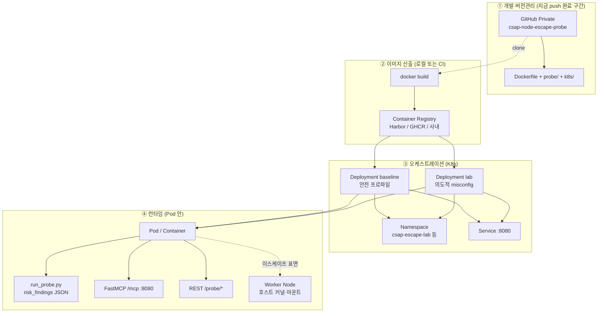
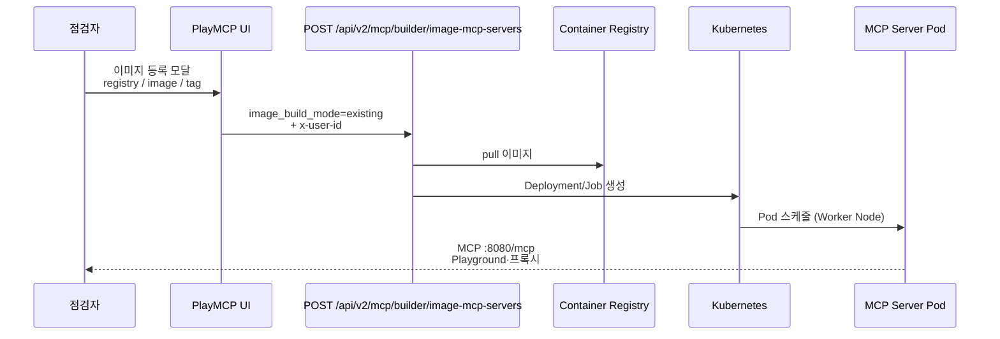
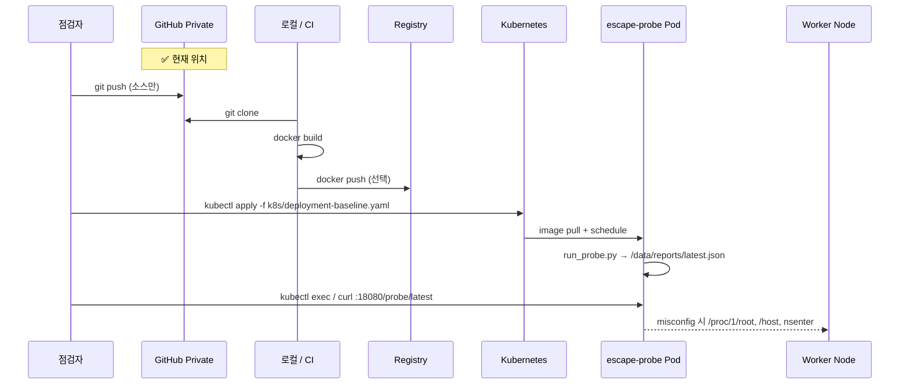
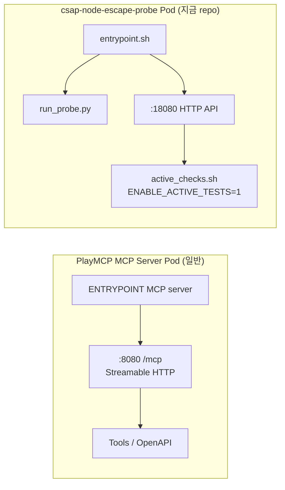
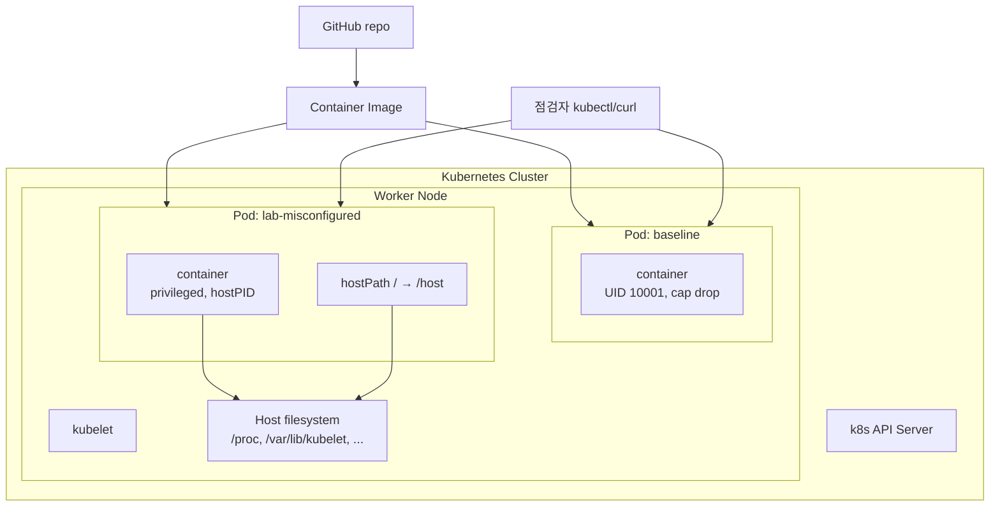

# csap-node-escape-probe — 배포 구상 (PlayMCP MCP 서버와의 대응)

> 지금 **GitHub에 push한 환경**을, PlayMCP가 MCP 서버를 올리는 방식과 **같은 레이어**로 나눠 본 문서입니다.

---

## 0. 한 줄 비교 (v2 — 통합)

| | PlayMCP **일반 MCP 서버** | **csap-node-escape-probe** (v2) |
|--|--------------------------|----------------------------------|
| 소스 | Git + 빌드 | **GitHub Private** `csap-node-escape-probe` |
| 프로토콜 | Streamable HTTP `:8080/mcp` | **동일** |
| 추가 기능 | — | MCP·REST로 **이스케이프 진단** (`run_escape_probe`) |
| UI 진입 | PlayMCP **이미지 등록** | **동일** (포트 **8080**) |
| 점검 목적 | Playground·API | MCP + **컨테이너→노드 표면** |

---

## 1. 전체 구성 (MCP 서버와 같은 4층)

PlayMCP MCP 서버도 **Git(또는 내부 repo) → 이미지 빌드 → 레지스트리 → K8s Deployment → Pod** 구조입니다.  
v2부터 **④에서 MCP `/mcp`와 프로브 `/probe/*`를 동시에** 제공합니다.

---

## 2. PlayMCP **이미지 등록 MCP** 흐름 (참고)

---

## 3. **지금 push 환경** — Escape Probe 흐름 (권장 점검 경로)

GitHub까지 push했다면 **①은 끝난 상태**입니다. 이후는 MCP와 같은 ②③④입니다.

### 3.1 PlayMCP UI로 올리는 경우 (MCP 서버와 **가장 비슷**)

이미지를 레지스트리에 push한 뒤 PlayMCP에서:

| UI 필드 | Escape Probe 값 |
|---------|-------------------|
| MCP 이름 | `csap-escape-probe` |
| 배포 방식 | 컨테이너 이미지 (existing) |
| 레지스트리 / 이미지 / 태그 | push한 경로 |
| 포트 | **18080** (MCP 기본 8080 아님) |

→ 백엔드가 **일반 워크로드 Pod**를 만들면, 구조상 MCP Pod와 **같은 슬롯**에 올라갑니다.  
다만 PlayMCP Playground는 **MCP 프로토콜**을 기대하므로, 이스케이프 점검만 할 때는 **`kubectl` 직접 배포**가 낫습니다.

---

## 4. Pod 내부 구성 (MCP Pod vs Probe Pod)

| 컴포넌트 | MCP 서버 Pod | Escape Probe Pod |
|----------|--------------|------------------|
| 진입점 | MCP 런타임 | `entrypoint.sh` |
| 주 서비스 | `/mcp` | `/health`, `POST /probe/run` |
| 데이터 | Tool 호출 로그 | `risk_findings` JSON |
| Service | PlayMCP Ingress 경유 | `k8s/service.yaml` :18080 |

---

## 5. K8s 위에서 Node까지 (점검 관점)

- **baseline**: 클러스터가 잘 잠겨 있으면 `risk_findings` 적음 → Node 표면 **닫힘** (정상).
- **lab**: 의도적 misconfig → `/host`, `/proc/1/root` 등 → **Node 접근 가능성** 수동 검증.

---

## 6. 역할 매핑표 (팀 공유용)

| PlayMCP / K8s 개념 | MCP 서버 워크로드 | Escape Probe (push한 repo) |
|--------------------|-------------------|----------------------------|
| Application name | `my-mcp-server` (DNS 이름) | `csap-escape-probe` |
| Container image | `registry/team/mcp-app:tag` | `registry/csap-node-escape-probe:v1` |
| Listen port | 8080 | **18080** |
| Health | (플랫폼/백엔드 정의) | `GET /health` |
| Config | env, OpenAPI | `ENABLE_ACTIVE_TESTS`, `PROBE_*` |
| Manifest | (플랫폼 생성) | `k8s/deployment-*.yaml` (repo에 포함) |
| Source of truth | (내부) | **GitHub Private** |

---

## 7. 권장 점검 시나리오 (push 환경 기준)

1. **GitHub** — Collaborator/PAT로 clone (소스 공유).
2. **Registry** — `docker build` / `push` (PlayMCP 등록 또는 K8s `image:`).
3. **baseline 배포** — `kubectl apply -f k8s/deployment-baseline.yaml`.
4. **리포트** — `curl /probe/latest` → finding 거의 없음 확인.
5. **lab 배포** (격리 NS) — `deployment-lab-misconfigured.yaml`.
6. **비교** — critical/high 증가 여부로 **Pod 설정 = 이스케이프 표면** 입증.
7. **수동** — `kubectl exec` → `nsenter`, `/host` (승인 범위만).

---

## 8. 보안 경계 (MCP와 동일하게 적용할 것)

- Registry credentials, `kubeconfig`, 점검 리포트에 **호스트 경로·SA 토큰** — GitHub에 커밋 금지.
- lab manifest는 **프로덕션 NS 금지**.
- Node SSH / kubelet API는 **컨테이너 이스케이프와 별도** 체크리스트.

---

*PlayMCP 번들 분석: 상위 `playmcp/02_architecture.md`, `04_api_endpoints.md` 참고.*
