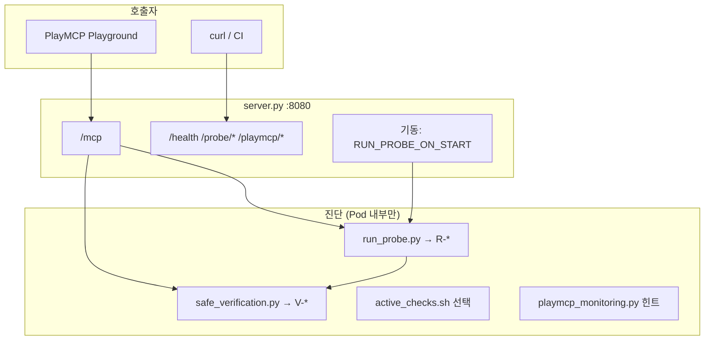

# CSAP — PlayMCP MCP + 컨테이너 이스케이프·안전 검증 (확장본)

> **PlayMCP「Git 소스 빌드」** — 이 폴더 **전체**를 Git remote 루트로 push (`Dockerfile`이 **루트**에 있음).  
> UI 등록값·검증 절차: **[`PLAYMCP_GIT_BUILD.md`](./PLAYMCP_GIT_BUILD.md)**  
> **원본** [`../csap-node-escape-probe-internal/`](../csap-node-escape-probe-internal/) — v2 기본만 (`repo/` 하위 구조).

| 구분 | `internal` (원본) | **`internal-full` (여기)** |
|------|-------------------|----------------------------|
| Git 빌드 레포 루트 | `repo/` 내용만 push | **이 디렉터리 루트** push |
| `R-*` / `V-*` | R만 | R + V |
| PlayMCP 모니터링 힌트 | ❌ | ✅ |

---

## 0. PlayMCP Git 소스 빌드 (빠른 시작)

| UI 필드 | 값 |
|---------|-----|
| MCP 서버 이름 | `csap-node-escape-probe` |
| Git URL | 이 저장소 URL |
| 브랜치 | `main` |
| Dockerfile | `Dockerfile` (기본) |
| 배포 후 포트 | **8080**, transport **streamablehttp**, path **`/mcp`** |

```bash
docker build -t csap-node-escape-probe:playmcp-git .
docker run --rm -p 8080:8080 csap-node-escape-probe:playmcp-git
curl -s http://127.0.0.1:8080/health
```

---

## 1. 한 줄 요약

**PlayMCP Streamable HTTP MCP 서버**이면서, Pod **내부**에서 컨테이너→노드 **이스케이프 표면**과 **저영향 보안 설정 검증**을 MCP 도구·REST로 수행합니다.  
**자동 익스플로잇·Kubelet 명령·클러스터 전체 스캔은 하지 않습니다.**

---

## 2. ⚠️ 사용 제한

- **승인된 CSAP·침투 점검 환경**에서만 사용
- 프로덕션·공용 클러스터 무단 배포 금지
- `ENABLE_ACTIVE_TESTS=1` · lab manifest는 **격리 NS**에서만
- critical finding 시 **kubectl exec** 수동 검증은 승인 범위 내에서만

---

## 3. 아키텍처 (3축)



상세 배포·PlayMCP 대응: [`ARCHITECTURE.md`](./ARCHITECTURE.md)  
PlayMCP InferenceService/Istio: [`../24_playmcp_istio_inference_service.md`](../24_playmcp_istio_inference_service.md)

---

## 4. HTTP 엔드포인트

| 메서드·경로 | 기능 | 진단 실행 |
|-------------|------|-----------|
| `http://<host>:8080/mcp` | MCP Streamable HTTP | 도구 호출 시 |
| `GET /health`, `/healthz` | 생존 + `probe_ready` | ❌ |
| `POST /probe/run` | **이스케이프 + 안전 검증** 통합 JSON | ✅ 전체 |
| `GET`/`POST` `/probe/safe-verify` | **안전 검증만** (부하 최소) | ✅ V-* 만 |
| `GET /probe/latest` | 마지막 저장 리포트 | ❌ 조회 |
| `GET /probe/manual` | 수동 검증 안내 | ❌ |
| `GET /playmcp/monitoring-hints` | PlayMCP 모니터링 점검 JSON | ❌ 힌트 |

**주의:** `GET /health`만으로는 전체 진단 결과가 오지 않습니다.

---

## 5. MCP 도구

### 5.1 연결·연동 (MCP)

| 도구 | 설명 | 컨테이너 진단 |
|------|------|----------------|
| `echo` | 연결·지연 테스트 | ❌ |
| `add` | smoke test | ❌ |
| `server_info` | 메타 + `playmcp_monitoring` 블록 | △ 힌트만 |

### 5.2 이스케이프·안전 검증

| 도구 | 설명 |
|------|------|
| `run_escape_probe` | `R-*` + `V-*` 통합 JSON, 저장 |
| `run_safe_verification` | `V-*` 만 (가벼움) |
| `get_escape_probe_summary` | 마지막 리포트 요약 텍스트 |
| `run_active_escape_checks` | `ENABLE_ACTIVE_TESTS=1` → `active_checks.sh` |
| `playmcp_monitoring_checklist` | InferenceService/Istio UI 오류 대응 안내 |

---

## 6. 자동 vs 수동 트리거

| 상황 | 동작 |
|------|------|
| Pod 기동 (`RUN_PROBE_ON_START=1`) | **1회** `save_report()` |
| Playground `echo`만 반복 | 진단 **재실행 안 함** |
| `POST /probe/run` / `run_escape_probe` | 즉시 전체 진단 |
| `PROBE_MIN_INTERVAL_SEC>0` | 간격 내 재호출 시 **캐시 반환** (`probe_throttled`) |

---

## 7. 이스케이프 진단 (`R-*`, `run_probe.py`)

### 7.1 수집 데이터 (읽기 전용)

| 섹션 | 내용 |
|------|------|
| `identity` | UID/GID, hostname |
| `environment` | hostPID 추정, env, `/proc` 프로세스 수 |
| `capabilities` | CapEff/CapPrm |
| `mounts` | mountinfo + host 의심 플래그 |
| `host_paths` | `/proc/1/root`, `/host`, `/var/lib/kubelet` |
| `kubernetes` | SA token·namespace·ca **존재 여부** (토큰 내용 없음) |
| `sockets` | docker/containerd sock |
| `commands` | `findmnt -J`, `nsenter --version` |

### 7.2 Finding ID (`R-*`)

| ID | 심각도 | 의미 |
|----|--------|------|
| `R-UID0` | high | root 실행 |
| `R-CAP-SYS-ADMIN` | high | 과도 capability |
| `R-MOUNT-HOST` | high | 호스트·kubelet·소켓 마운트 |
| `R-PROC1-ROOT` | **critical** | 호스트 init FS 열람 |
| `R-DOCKER-SOCK` / `R-CONTAINERD-SOCK` | **critical** | 런타임 소켓 |
| `R-K8S-SA` | info | SA 토큰 마운트 |
| `R-HOST-PID` | high | hostPID 가능 |
| `R-HOST-NET` | medium | hostNetwork env |

---

## 8. 안전 검증 (`V-*`, `safe_verification.py`)

서비스 영향 최소: **파일 읽기**, `ss` 3초, TCP connect 0.8초(선택).

| ID | 심각도 | 검증 |
|----|--------|------|
| `V-NONEW-PRIVS` | medium | NoNewPrivs 미적용 |
| `V-SECCOMP-DISABLED` | medium | seccomp 없음 |
| `V-LSM-UNCONFINED` | medium | AppArmor unconfined |
| `V-ROOT-WRITABLE` | medium | `/` 쓰기 가능 |
| `V-MOUNT-RW-SENSITIVE` | high | 민감 경로 RW |
| `V-CAP-*` | high | NET_RAW, SYS_PTRACE 등 |
| `V-ENV-SENSITIVE-KEYS` | info | PASSWORD/TOKEN 등 **키 이름만** |
| `V-K8S-TOKEN-WORLD-READ` | high | 토큰 world-readable |
| `V-RUNTIME-SOCK` | critical | cri/docker/containerd sock |
| `V-NS-SHARE-*` | high/medium | pid/ipc/net/mnt NS 호스트 공유 |
| `V-LISTEN-WILDCARD` | info | 0.0.0.0 리스너 |
| `V-NET-CLOUD-METADATA` | info | `ENABLE_SAFE_NET_CHECKS=1` 시 |
| `V-NET-K8S-API` | info | 동일 |

---

## 9. `active_checks.sh` (선택)

`ENABLE_ACTIVE_TESTS=1` 일 때만.

- 경로 존재·`ls` (최대 15줄)
- NS inode self vs PID1 비교
- `nsenter` read-only `ls /` (실패도 기록)
- **쓰기·kill 없음**

---

## 10. PlayMCP 연동

### 10.1 이미지 등록

| 필드 | 값 |
|------|-----|
| MCP 이름 | `csap-node-escape-probe` (DNS 규칙) |
| 포트 | **8080** |
| Transport | `streamablehttp` |
| MCP URL | `http://<svc>:8080/mcp` |

```bash
# Git 소스 빌드: PlayMCP가 clone 후 docker build (로컬 검증)
docker build -t csap-node-escape-probe:playmcp-git .

# 레지스트리 직접 push 시
export REGISTRY=<harbor>/<project>
make build TAG=playmcp-git
make push TAG=playmcp-git REGISTRY=$REGISTRY
```

### 10.2 MCP vs 모니터링 vs Kubelet

| 기능 | 이 이미지 | PlayMCP 플랫폼 |
|------|-----------|----------------|
| MCP Playground | ✅ | ✅ |
| Pod 내 진단 JSON | ✅ | — |
| 모니터링 RPS 차트 | 힌트만 | InferenceService + Istio/Prom |
| Kubelet 명령 | ❌ | ❌ (기본) |

UI **「InferenceService가 없습니다」** → [`../24_playmcp_istio_inference_service.md`](../24_playmcp_istio_inference_service.md)

```bash
curl -s http://127.0.0.1:8080/playmcp/monitoring-hints | python3 -m json.tool
MCP_NAME=csap-node-escape-probe NS=<ns> ../scripts/check-playmcp-istio-monitoring.sh
```

### 10.3 호스팅 시 권장 env

```yaml
env:
  - name: PROBE_MIN_INTERVAL_SEC
    value: "60"
  - name: ENABLE_SAFE_NET_CHECKS
    value: "0"
  - name: ENABLE_ACTIVE_TESTS
    value: "0"
  - name: POD_NAME
    valueFrom:
      fieldRef:
        fieldPath: metadata.name
  - name: POD_NAMESPACE
    valueFrom:
      fieldRef:
        fieldPath: metadata.namespace
```

---

## 11. Kubernetes 프로파일

| 프로파일 | 파일 | 기대 |
|----------|------|------|
| baseline | `k8s/deployment-baseline.yaml` | `R-*`/`V-*` 적음 |
| lab | `k8s/deployment-lab-misconfigured.yaml` | critical/high 증가 |

```bash
kubectl apply -f k8s/deployment-baseline.yaml -f k8s/service.yaml
kubectl port-forward svc/csap-escape-probe 8080:8080
curl -s -X POST http://127.0.0.1:8080/probe/run | jq '.summary'
curl -s http://127.0.0.1:8080/probe/safe-verify | jq '.risk_findings'
```

---

## 12. 환경 변수

| 변수 | 기본 | 설명 |
|------|------|------|
| `PORT` | `8080` | HTTP·MCP |
| `MCP_SERVER_NAME` | `csap-node-escape-probe` | MCP·IS 이름 참고 |
| `MCP_SERVER_VERSION` | `2.1.0-playmcp-git` | |
| `RUN_PROBE_ON_START` | `1` | 기동 시 1회 프로브 |
| `PROBE_REPORT_DIR` | `/data/reports` | JSON 저장 |
| `ENABLE_ACTIVE_TESTS` | `0` | active_checks |
| `ENABLE_SAFE_NET_CHECKS` | `0` | 169.254 / K8s API TCP |
| `PROBE_MIN_INTERVAL_SEC` | `0` | 연속 프로브 제한(초) |
| `ENV_PROFILE` | `test` | |
| `POD_NAME` / `POD_NAMESPACE` / `NODE_NAME` | — | downward API 권장 |

---

## 13. 리포트 JSON 예시

```json
{
  "generated_at": "2026-06-02T12:00:00+00:00",
  "safe_verification": { "proc_status": {}, "namespaces": {} },
  "risk_findings": [
    { "id": "R-K8S-SA", "severity": "info", "title": "..." },
    { "id": "V-SECCOMP-DISABLED", "severity": "medium", "title": "..." }
  ],
  "summary": {
    "finding_count": 2,
    "escape_finding_count": 1,
    "safe_verification_finding_count": 1,
    "max_severity": "medium"
  }
}
```

---

## 14. 포함하지 않는 것

- Kubelet API·노드 SSH·다른 Pod 조작
- 환경 변수 **값** 수집·exfil
- 자동 익스플로잇·쉘 설치
- PlayMCP Prometheus 직접 연동
- 모든 HTTP 요청에 대한 자동 전체 진단

---

## 15. 디렉터리

| 경로 | 용도 |
|------|------|
| [`server.py`](./server.py) | FastMCP + Starlette |
| [`probe/run_probe.py`](./probe/run_probe.py) | `R-*` |
| [`probe/safe_verification.py`](./probe/safe_verification.py) | `V-*` |
| [`probe/playmcp_monitoring.py`](./probe/playmcp_monitoring.py) | UI 힌트 |
| [`probe/active_checks.sh`](./probe/active_checks.sh) | 활성 읽기 검사 |
| [`k8s/`](./k8s/) | baseline / lab |

---

## 16. 빠른 명령

```bash
cd playmcp/csap-node-escape-probe-internal-full
make build && make run
make mcp-health

# 전체 진단
curl -s -X POST http://127.0.0.1:8080/probe/run | python3 -m json.tool

# 가벼운 검증만
curl -s http://127.0.0.1:8080/probe/safe-verify | python3 -m json.tool

# PlayMCP Playground: run_escape_probe, run_safe_verification, server_info
```

---

## 17. 관련 문서

- 원본(기본): [`../csap-node-escape-probe-internal/README.md`](../csap-node-escape-probe-internal/README.md)
- 공개 정리본: [`../csap-node-escape-probe/README.md`](../csap-node-escape-probe/README.md)
- PlayMCP 번들: [`../00_README.md`](../00_README.md)
