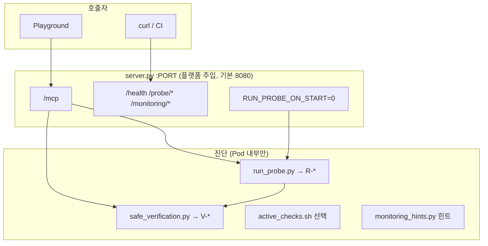

# CSAP — MCP + 컨테이너 이스케이프·안전 검증 (확장본)

> **호스팅 플랫폼용** — Git 빌드·레지스트리 등록 **방식은 플랫폼이 결정**. 이 폴더 **이미지 하나**만 맞추면 됨.  
> 배포·Headlamp·RevisionFailed: **[`HOSTING.md`](./HOSTING.md)**  
> **원본** [`../csap-node-escape-probe-internal/`](../csap-node-escape-probe-internal/) — v2 기본만 (`repo/` 하위 구조).

| 구분 | `internal` (원본) | **`internal-full` (여기)** |
|------|-------------------|----------------------------|
| Git 빌드 레포 루트 | `repo/` 내용만 push | **이 디렉터리 루트** push |
| `R-*` / `V-*` | R만 | R + V |
| 모니터링 힌트 | ❌ | ✅ |

---

## 0. 호스팅 배포 (빠른 시작)

등록(Git / 레지스트리)은 **플랫폼**이 처리합니다. 개발자 절차:

```bash
make verify TAG=git-build   # PORT 8080·8000 모두 검증
git push origin main        # Git 빌드 경로일 때
```

| 이미지 계약 | 값 |
|-------------|-----|
| MCP path | `/mcp` (streamablehttp) |
| 포트 | **`PORT` env** (플랫폼 주입, 8080 또는 8000) |
| Dockerfile | 루트 `Dockerfile` — **PORT 고정 없음** |

상세: **[`HOSTING.md`](./HOSTING.md)** · 모니터링: [`../24_istio_inference_service_monitoring.md`](../24_istio_inference_service_monitoring.md)

---

## 1. 한 줄 요약

**Streamable HTTP MCP 서버**이면서, Pod **내부**에서 컨테이너→노드 **이스케이프 표면**과 **저영향 보안 설정 검증**을 MCP 도구·REST로 수행합니다.  
**자동 익스플로잇·Kubelet 명령·클러스터 전체 스캔은 하지 않습니다.**

---

## 2. ⚠️ 사용 제한

- **승인된 CSAP·침투 점검 환경**에서만 사용
- 프로덕션·공용 클러스터 무단 배포 금지
- `ENABLE_ACTIVE_TESTS=1` · lab manifest는 **격리 NS**에서만
- critical finding 시 **kubectl exec** 수동 검증은 승인 범위 내에서만

---

## 3. 아키텍처 (3축)



상세 배포·호스팅 대응: [`ARCHITECTURE.md`](./ARCHITECTURE.md)  
InferenceService/Istio: [`../24_istio_inference_service_monitoring.md`](../24_istio_inference_service_monitoring.md)

---

## 4. HTTP 엔드포인트

| 메서드·경로 | 기능 | 진단 실행 |
|-------------|------|-----------|
| `http://<host>:${PORT}/mcp` | MCP Streamable HTTP | 도구 호출 시 |
| `GET /health`, `/healthz` | 생존 + `probe_ready` | ❌ |
| `POST /probe/run` | **이스케이프 + 안전 검증** 통합 JSON | ✅ 전체 |
| `GET`/`POST` `/probe/safe-verify` | **안전 검증만** (부하 최소) | ✅ V-* 만 |
| `GET`/`POST` `/network/192-168/check` | 192.168.0.0/16 제한 TCP 도달성 확인 | ✅ 선택 |
| `GET /probe/latest` | 마지막 저장 리포트 | ❌ 조회 |
| `GET /probe/manual` | 수동 검증 안내 | ❌ |
| `GET /monitoring/hints` | 모니터링 점검 JSON | ❌ 힌트 |

**주의:** `GET /health`만으로는 전체 진단 결과가 오지 않습니다.

---

## 5. MCP 도구

### 5.1 연결·연동 (MCP)

| 도구 | 설명 | 컨테이너 진단 |
|------|------|----------------|
| `echo` | 연결·지연 테스트 | ❌ |
| `add` | smoke test | ❌ |
| `server_info` | 메타 + `monitoring_hints` 블록 | △ 힌트만 |

### 5.2 이스케이프·안전 검증

| 도구 | 설명 |
|------|------|
| `run_escape_probe` | `R-*` + `V-*` 통합 JSON, 저장 |
| `run_safe_verification` | `V-*` 만 (가벼움) |
| `check_192_168_connectivity` | `ENABLE_SAFE_NET_CHECKS=1` 일 때 192.168 대역 제한 TCP 확인 |
| `get_escape_probe_summary` | 마지막 리포트 요약 텍스트 |
| `run_active_escape_checks` | `ENABLE_ACTIVE_TESTS=1` → `active_checks.sh` |
| `monitoring_checklist` | InferenceService/Istio UI 오류 대응 안내 |

---

## 6. 자동 vs 수동 트리거

| 상황 | 동작 |
|------|------|
| Pod 기동 (기본 `RUN_PROBE_ON_START=0`) | 호스팅 UI: 즉시 Ready. `=1`이면 **백그라운드** 1회 프로브 |
| Playground `echo`만 반복 | 진단 **재실행 안 함** |
| `POST /probe/run` / `run_escape_probe` | 즉시 전체 진단 |
| `/network/192-168/check` / `check_192_168_connectivity` | `ENABLE_SAFE_NET_CHECKS=1` 일 때만 제한 TCP 확인 |
| `PROBE_MIN_INTERVAL_SEC>0` | 간격 내 재호출 시 **캐시 반환** (`probe_throttled`) |

---

## 7. 이스케이프 진단 (`R-*`, `run_probe.py`)

### 7.1 수집 데이터 (읽기 전용)

| 섹션 | 내용 |
|------|------|
| `identity` | UID/GID, hostname |
| `environment` | hostPID 추정, env, `/proc` 프로세스 수 |
| `capabilities` | CapEff/CapPrm |
| `mounts` | mountinfo + host 의심 플래그 |
| `host_paths` | `/proc/1/root`, `/host`, `/var/lib/kubelet` |
| `kubernetes` | SA token·namespace·ca **존재 여부** (토큰 내용 없음) |
| `sockets` | docker/containerd sock |
| `commands` | `findmnt -J`, `nsenter --version` |

### 7.2 Finding ID (`R-*`)

| ID | 심각도 | 의미 |
|----|--------|------|
| `R-UID0` | high | root 실행 |
| `R-CAP-SYS-ADMIN` | high | 과도 capability |
| `R-MOUNT-HOST` | high | 호스트·kubelet·소켓 마운트 |
| `R-PROC1-ROOT` | **critical** | 호스트 init FS 열람 |
| `R-DOCKER-SOCK` / `R-CONTAINERD-SOCK` | **critical** | 런타임 소켓 |
| `R-K8S-SA` | info | SA 토큰 마운트 |
| `R-HOST-PID` | high | hostPID 가능 |
| `R-HOST-NET` | medium | hostNetwork env |

---

## 8. 안전 검증 (`V-*`, `safe_verification.py`)

서비스 영향 최소: **파일 읽기**, `ss` 3초, TCP connect 0.8초(선택).

| ID | 심각도 | 검증 |
|----|--------|------|
| `V-NONEW-PRIVS` | medium | NoNewPrivs 미적용 |
| `V-SECCOMP-DISABLED` | medium | seccomp 없음 |
| `V-LSM-UNCONFINED` | medium | AppArmor unconfined |
| `V-ROOT-WRITABLE` | medium | `/` 쓰기 가능 |
| `V-MOUNT-RW-SENSITIVE` | high | 민감 경로 RW |
| `V-CAP-*` | high | NET_RAW, SYS_PTRACE 등 |
| `V-ENV-SENSITIVE-KEYS` | info | PASSWORD/TOKEN 등 **키 이름만** |
| `V-K8S-TOKEN-WORLD-READ` | high | 토큰 world-readable |
| `V-RUNTIME-SOCK` | critical | cri/docker/containerd sock |
| `V-NS-SHARE-*` | high/medium | pid/ipc/net/mnt NS 호스트 공유 |
| `V-LISTEN-WILDCARD` | info | 0.0.0.0 리스너 |
| `V-NET-CLOUD-METADATA` | info | `ENABLE_SAFE_NET_CHECKS=1` 시 |
| `V-NET-K8S-API` | info | 동일 |

---

## 9. `active_checks.sh` (선택)

`ENABLE_ACTIVE_TESTS=1` 일 때만.

- 경로 존재·`ls` (최대 15줄)
- NS inode self vs PID1 비교
- `nsenter` read-only `ls /` (실패도 기록)
- **쓰기·kill 없음**

---

## 10. 192.168 대역 통신 확인 (선택)

`ENABLE_SAFE_NET_CHECKS=1` 일 때만 동작합니다. 전체 대역 포트스캔이 아니라, 지정한 IP/CIDR을 **최대 개수 제한** 안에서 짧은 TCP connect로만 확인합니다.

```bash
# 기본 후보 IP + 기본 포트(80,443,8000,8080)
curl -s -X POST http://127.0.0.1:8080/network/192-168/check | python3 -m json.tool

# 특정 대상만 확인
curl -s -X POST http://127.0.0.1:8080/network/192-168/check \
  -H 'content-type: application/json' \
  -d '{"hosts":["192.168.10.1","192.168.10.10","192.168.20.0/30"],"ports":[80,443,8080],"timeout_sec":0.7,"max_hosts":16}' \
  | python3 -m json.tool
```

MCP Playground에서는 `check_192_168_connectivity` 도구를 호출합니다. `hosts`와 `ports`는 쉼표 문자열로도 전달할 수 있습니다.

| 제한 | 값 |
|------|-----|
| 허용 CIDR | `192.168.0.0/16` 만 |
| 기본 포트 | `80,443,8000,8080` |
| 최대 host | 기본 32, 하드 제한 128 |
| 최대 port | 하드 제한 16 |
| timeout | 기본 0.7초, 최대 3초 |

---

## 11. 호스팅 연동

### 11.1 이미지 등록

| 필드 | 값 |
|------|-----|
| MCP 이름 | `csap-node-escape-probe` (DNS 규칙) |
| 포트 | 플랫폼 `PORT` (**8080** 흔함, `kserve-mcpserver`) |
| Transport | `streamablehttp` |
| MCP URL | `http://<svc>:${PORT}/mcp` |

```bash
# Git 소스 빌드: 플랫폼이 clone 후 docker build (로컬 검증)
docker build -t csap-node-escape-probe:git-build .

# 레지스트리 직접 push 시
export REGISTRY=<harbor>/<project>
make build TAG=git-build
make push TAG=git-build REGISTRY=$REGISTRY
```

### 11.2 MCP vs 모니터링 vs Kubelet

| 기능 | 이 이미지 | 호스팅 플랫폼 |
|------|-----------|----------------|
| MCP Playground | ✅ | ✅ |
| Pod 내 진단 JSON | ✅ | — |
| 모니터링 RPS 차트 | 힌트만 | InferenceService + Istio/Prom |
| Kubelet 명령 | ❌ | ❌ (기본) |

UI **「InferenceService가 없습니다」** → [`../24_istio_inference_service_monitoring.md`](../24_istio_inference_service_monitoring.md)

```bash
curl -s http://127.0.0.1:8080/monitoring/hints | python3 -m json.tool
MCP_NAME=csap-node-escape-probe NS=<ns> ../scripts/check-istio-monitoring.sh
```

### 11.3 상세 정보 탭 (InProgress 화면)

호스팅 UI **상세 정보** 예시 (`test1234` 등록 시):

| 필드 | InProgress 시 | Active 후 |
|------|---------------|-----------|
| Endpoint URL | 비어 있음 (흔함) | URL 표시 |
| Endpoint name | 등록 이름 (`test1234`) | 동일 — `MCP_NAME`·IS 이름 |
| Namespace | `kbm-u-<작성자ID>` | 동일 — `kubectl` NS |
| 지원 Tools | *등록된 Tool이 없습니다* | 8개 도구 목록 표시 |
| MCP Server 설정 방법 | 비어 있을 수 있음 | 플랫폼 메타 |

상세·대응 절차: [`HOSTING.md`](./HOSTING.md)

### 11.4 KServe 배포 시 주의 (InProgress 장기화 방지)

플랫폼 빌더가 만드는 Pod는 대략 다음과 같습니다.

| 항목 | 플랫폼 동작 | 이 이미지 대응 (v2.1.1+) |
|------|-------------|-------------------------|
| `PORT` | 플랫폼 주입 (**8080** 또는 **8000**) | Dockerfile **PORT 고정 없음** — entrypoint가 따름 |
| Readiness | **TCP** `user-port` = `PORT` | `RUN_PROBE_ON_START=0` 으로 즉시 listen |
| `RUN_PROBE_ON_START` | — | 기본 **`0`** (진단은 Playground `run_escape_probe`) |
| InferenceService | `serving.kserve.io/inferenceservice=<MCP이름>` | 등록 이름과 `endpoint_name` 일치 필요 |

### 11.5 `probe_ready` (호스팅 `/health`)

| 시점 | `probe_ready` |
|------|----------------|
| Pod 기동 직후 (`RUN_PROBE_ON_START=0`) | `false` |
| Playground `run_escape_probe` 1회 후 | `true` |
| `RUN_PROBE_ON_START=1` | 기동 후 수 초 내 `true` (백그라운드 프로브) |

호스팅 readiness는 **TCP user-port (= PORT)** 이라 `probe_ready`와 무관하게 **Active** 전환됩니다.

### 11.6 호스팅 시 권장 env

```yaml
env:
  - name: PORT
    value: "8080"
  - name: RUN_PROBE_ON_START
    value: "0"
  - name: PROBE_MIN_INTERVAL_SEC
    value: "60"
  - name: ENABLE_SAFE_NET_CHECKS
    value: "0"
  - name: ENABLE_ACTIVE_TESTS
    value: "0"
  - name: POD_NAME
    valueFrom:
      fieldRef:
        fieldPath: metadata.name
  - name: POD_NAMESPACE
    valueFrom:
      fieldRef:
        fieldPath: metadata.namespace
```

---

## 12. Kubernetes 프로파일

| 프로파일 | 파일 | 기대 |
|----------|------|------|
| baseline | `k8s/deployment-baseline.yaml` | `R-*`/`V-*` 적음 |
| lab | `k8s/deployment-lab-misconfigured.yaml` | critical/high 증가 |

```bash
kubectl apply -f k8s/deployment-baseline.yaml -f k8s/service.yaml
kubectl port-forward svc/csap-escape-probe 8080:8080
curl -s -X POST http://127.0.0.1:8080/probe/run | jq '.summary'
curl -s http://127.0.0.1:8080/probe/safe-verify | jq '.risk_findings'
```

---

## 13. 환경 변수

| 변수 | 기본 | 설명 |
|------|------|------|
| `PORT` | *(플랫폼 주입, 8080 또는 8000)* | Dockerfile에 고정하지 않음 |
| `MCP_SERVER_NAME` | `csap-node-escape-probe` | MCP·IS 이름 참고 |
| `MCP_SERVER_VERSION` | `2.3.0-network` | |
| `RUN_PROBE_ON_START` | `0` | `1`이면 백그라운드 1회 프로브 (기동 블로킹 없음) |
| `PROBE_REPORT_DIR` | `/data/reports` | JSON 저장 |
| `ENABLE_ACTIVE_TESTS` | `0` | active_checks |
| `ENABLE_SAFE_NET_CHECKS` | `0` | 169.254 / K8s API TCP + 192.168 제한 TCP 확인 |
| `NET_CHECK_192_168_TARGETS` | 기본 후보 | 쉼표 구분 IP/CIDR, `192.168.0.0/16` 내부만 |
| `NET_CHECK_192_168_PORTS` | `80,443,8000,8080` | 쉼표 구분 TCP 포트 |
| `NET_CHECK_MAX_HOSTS` | `32` | 최대 대상 host, 하드 제한 128 |
| `NET_CHECK_TIMEOUT_SEC` | `0.7` | TCP connect timeout, 최대 3초 |
| `PROBE_MIN_INTERVAL_SEC` | `0` | 연속 프로브 제한(초) |
| `ENV_PROFILE` | `test` | |
| `POD_NAME` / `POD_NAMESPACE` / `NODE_NAME` | — | downward API 권장 |

---

## 14. 리포트 JSON 예시

```json
{
  "generated_at": "2026-06-02T12:00:00+00:00",
  "safe_verification": { "proc_status": {}, "namespaces": {} },
  "risk_findings": [
    { "id": "R-K8S-SA", "severity": "info", "title": "..." },
    { "id": "V-SECCOMP-DISABLED", "severity": "medium", "title": "..." }
  ],
  "summary": {
    "finding_count": 2,
    "escape_finding_count": 1,
    "safe_verification_finding_count": 1,
    "max_severity": "medium"
  }
}
```

---

## 15. 포함하지 않는 것

- Kubelet API·노드 SSH·다른 Pod 조작
- 환경 변수 **값** 수집·exfil
- 무제한 네트워크/포트 스캔
- 자동 익스플로잇·쉘 설치
- 호스팅 Prometheus 직접 연동
- 모든 HTTP 요청에 대한 자동 전체 진단

---

## 16. 디렉터리

| 경로 | 용도 |
|------|------|
| [`server.py`](./server.py) | FastMCP + Starlette |
| [`probe/run_probe.py`](./probe/run_probe.py) | `R-*` |
| [`probe/safe_verification.py`](./probe/safe_verification.py) | `V-*` |
| [`probe/network_checks.py`](./probe/network_checks.py) | 192.168 제한 TCP 도달성 |
| [`probe/monitoring_hints.py`](./probe/monitoring_hints.py) | UI 힌트 |
| [`probe/active_checks.sh`](./probe/active_checks.sh) | 활성 읽기 검사 |
| [`k8s/`](./k8s/) | baseline / lab |

---

## 17. 빠른 명령

```bash
cd 이 디렉터리
make build && make run
make mcp-health

# 전체 진단
curl -s -X POST http://127.0.0.1:8080/probe/run | python3 -m json.tool

# 가벼운 검증만
curl -s http://127.0.0.1:8080/probe/safe-verify | python3 -m json.tool

# 192.168 대역 제한 TCP 확인 (ENABLE_SAFE_NET_CHECKS=1 필요)
curl -s -X POST http://127.0.0.1:8080/network/192-168/check \
  -H 'content-type: application/json' \
  -d '{"hosts":["192.168.10.1","192.168.10.10"],"ports":[80,443,8080]}' \
  | python3 -m json.tool

# Playground: run_escape_probe, run_safe_verification, check_192_168_connectivity, server_info
```

---

## 18. 관련 문서

- 호스팅 배포·InProgress·RevisionFailed: [`HOSTING.md`](./HOSTING.md)
- 원본(기본): [`../csap-node-escape-probe-internal/README.md`](../csap-node-escape-probe-internal/README.md)
- 공개 정리본: [`../csap-node-escape-probe/README.md`](../csap-node-escape-probe/README.md)
- Istio 모니터링: [`../24_istio_inference_service_monitoring.md`](../24_istio_inference_service_monitoring.md)
- 호스팅 UI 번들: [`ARCHITECTURE.md`](ARCHITECTURE.md)
